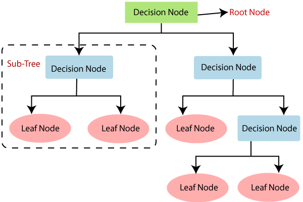

# Decision Trees

Decision trees use tree-like models of decisions and their possible consequences. It can be used to easily represent algorithms with only conditional statements(no loops). In machine learning, they are used mostly for classification. 

Here is an example of a decision tree for classification. The objective is to find if a person is fit or not. The tree can be very easily interpreted, which is one of the positives of decision trees (used for analysing structures in data).


Our objective is to have this tree being built by analysing a dataset. For this, let us try to analyse this tree and why it works.

## Understanding the fitting process

If we look at the above tree, the top decision, Age < 30 divides the dataset into two (age<30 and otherwise). Each of these are easier to further classify than the source dataset. Our objective is to find the best parameter to divide the datasets into such halves. Here, for the root node, it was Age, and the threshold was 30. In order to do this, we use a score, called the **Gini impurity**.

It is a measure of how uniform the dataset is, with respect to the outputs desired. For example, a dataset with only one class will have a gini impurity of 0 (perfectly pure), while one with a uniform distribution of 3 classes will have a higher gini impurity. It is defined as:


Where p(i) is the proportion of class i, in the full dataset. FOr example, if there is 50 elements of class 1 in a dataset with 150 elements, ```p(1) = 1/3```. For a dataset with 2 classes, both uniformly distributed p(1)=p(2)=0.5, the gini impurity will be computed as


For some decision node, this is computed for both the splitted datasets, and their weighted sum (wieght is total number of elements in each of these) is found. The best way to split the dataset is found by trial and error by checking all the parameters, with different  thresholds each and computing the gini impurity of their splits. This is then repeated for the next level, using the splitted dataset.

If the gini impurity after splitting does not improve from the original dataset, them the decision node is deemed useless. In such a case the node is made into a 'leaf node'. That is, upon reaching that node, the sample is classified as some output. While fitting, the mode (most frequently occuring class in that dataset) is chosen as the output. Leaf nodes can also be formed by setting a maximum depth to the tree.



---

## Version 1 implementation

I have implemented decision trees using a class, called DecisionNode. Each object represents a single node. The advantage is being able to finely control each and every node of the decision tree. It also has a basic debug feature that prints information about the training process. The interface is as follows :

- Data members
  - name : String, for identification while debugging
  - parent : DecisionNode object, which is the parent node, stored for debugging, not used while fitting or classifying
  - level : The level of tree in which node exists, for debugging
  - leaf : Boolean, true if and only if the node is a leaf node
  - state : The output to return if a leaf node
  - col : String, name of the column that is compared, if a decision node
  - thresh : Integer, value of threshold for comparison, if a leaf node
  - upper : DecisionNode object, which is the upper child node (called when input[col_name] > thresh)
  - lower : DecisionNode object, which is the lower child node (called when input[col_name] <= thresh)
  - debug : Boolean, true if debug information is to be printed

- Member function
  - make_leaf(output)
    - Makes the node a leaf node and sets its state as output
  - train(data, [force_decision])
    - Finds the best way to split the data (col_name, thresh). If the split is deemed unnecessary, the node is automatically made a leaf node
    - force_decision can be set true for disabling automatically turning the node into a leaf node.
  - split(data)
    - If a trained decision node, splits the dataset using the stored decision rule (col_name, thresh)
  - attach_upper(node)
    - Sets the passed node as upper child node
  - attach_lower(node)
    - Sets the passed node as lower child node
  - classify(input)
    - If a leaf node, returns the output state of the leaf node. 
    - Else, compares input with stored decision rule, and appropriately calls classify node of upper or lower child node.
  - make_children()
    - Creates and links upper and lower child nodes, and names them appropriately
    - Upper child node has a '+' appended to parent name
    - Lower child node has a '-' appended to parent name
  - get_children()
    - Return the upper and lower child nodes
  - set_debug(state, propagate)
    - Sets debug to state
    - If propagate is true, calls set_debug with the same state of child nodes. This makes changing debug property of entire tree or a subtree effortless.

### How to build a decision tree?

Using my class, a tree can be build using recursive depth-first search. First, a root node is created. This node must be saved for clasification. Then, it is trained on the full dataset. After training, its children are initialised and the dataset is split into upper and lower halves (by passing through the decision criteria). Then, the upper child node goes through the same process, training and making its own child nodes, but with only the upper dataset, and the lower child node goes through a similar process. This terminates when either training results in a leaf node, or a set maximum limit criteria was reached.

For classification, the root node is passed the input, and depending on its parameters, it passes it to one of its children. When a leaf node is reached, it returns its state and this is returned all the way back to the initial call from the root node, in the same path that was followed down. So, the classify function of the root node returns the required classification value.

### Performance

Common settings - 5 level tree, 10% of dataset taken as test set

|Dataset|size (samples x features)|Training time(s)|Test set accuracy|Train set accurracy|
|---|---|---|---|---|
|Digits|1797 x 64|68.624|63.13%|69.41%|
|Iris|150 x 4|0.659|100%|97.04%|
|Breast cancer|569 x 30|121.020|89.29%|98.83%|
|Wine|178 x 13|11.220|88.24%|98.76%|

[Decision tree learned for iris dataset](./Images/iris_decisiontree.png) :

[Decision tree learned for breast cancer dataset](./Images/breast_cancer_decisiontree.jpeg) :


### Observations

- Does not work well in all situations.
- Easy to interpret and fast to predict.
- High variance (overfitting)

---

## Version 2

1. In earlier implementation, the training process will involve trial and error for finding the threshold, and will check for all posible gaps between input values in the data. This is very time consuming, and often wasteful. A maximum threshold try limit was added. If there are more thresholds found, random sampling without replacement is used. This slightly reduces overfitting too.

2. Added a minimum data condition. If the data given to a tree is lower than a limit, the node is turned into a leaf node. This reduces overfitting.

3. Stopped dropping a column once it was used earlier in a decision tree.

### Performance

Common settings

- 5 level tree
- 10% of dataset taken as test set
- Maximum threshold tries : 10%
- Minimum data : 20

|Dataset|size (samples x features)|Training time(s)|Test set accuracy|Train set accurracy|
|---|---|---|---|---|
|Digits|1797 x 64|61.309|65.92%|70.40%|
|Iris|150 x 4|0.748|100%|97.78%|
|Breast cancer|569 x 30|8.805|96.43%|97.08%|
|Wine|178 x 13|2.985|94.12%|97.52%|

[Decision tree learned for iris dataset](./Images/iris_decisiontree_v2.jpeg) :

[Decision tree learned for breast cancer dataset](./Images/breast_cancer_decisiontree_v2.jpeg) :


### Observations

- Much faster training (except digits)
- Better generalisation
- Still bad performance with unstructured data (like digits)

---

## References

1. [Geeksforgeeks](https://www.geeksforgeeks.org/decision-tree-introduction-example/#:~:text=Decision%20tree%20uses%20the%20tree,attributes%20using%20the%20decision%20tree.)

2. [Statquest youtube channel](https://www.youtube.com/watch?v=7VeUPuFGJHk)

3. [Medium article by Artyom Kulakov](https://medium.com/datadriveninvestor/easy-implementation-of-decision-tree-with-python-numpy-9ec64f05f8ae)

4. [Towardsai.net](https://towardsai.net/p/programming/decision-trees-explained-with-a-practical-example-fe47872d3b53)

5. [Gini impurity - victorzhou](https://victorzhou.com/blog/gini-impurity/)